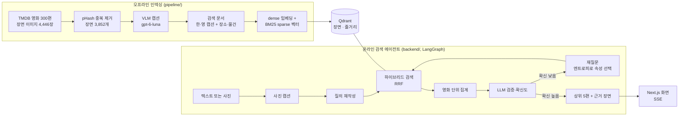

# Movie Scene Finder (장면 기억 검색기)

제목은 몰라도 장면은 기억나는 영화를, 장면 묘사나 화면 사진으로 찾아 주는 검색 서비스입니다.

**데모: https://movie-scene-finder-pi.vercel.app** · 평가 대시보드: [/eval](https://movie-scene-finder-pi.vercel.app/eval)

<!-- TODO(데모): 2분 데모 영상에서 GIF를 만들어 docs/demo.gif로 넣는다 -->


"비 오는 밤, 가족이 긴 계단을 한참 내려가던 장면"처럼 흐릿하게 적어도, 미리 만들어 둔 장면 설명
색인에서 영화를 찾습니다. 확신이 서지 않으면 "언제쯤 나온 영화였는지 기억나세요?"처럼 최대 두 번
되물어 후보를 좁히고, 상위 5편과 근거 장면을 보여 줍니다.

## 결과 요약

test 셋으로 한 번만 잰 최종 결과입니다(2026-10-05, 커밋 `472287c`, `eval_runs` 38~43). 설정은 모두 dev로 정했고,
test는 이 측정에만 썼습니다. 요청 p95는 질의를 하나씩 순서대로 보낸 로컬 측정입니다.

| 데이터 (test) | Recall@1 | Recall@5 | MRR | 평균 재질문 | 요청 p95 | 질의당 비용 |
| --- | --- | --- | --- | --- | --- | --- |
| **사람이 쓴 묘사 (50)** | **0.360** | **0.440** | 0.400 | 0.96회 | 7.9초 | $0.00064 (약 0.9원) |
| 합성 기억 묘사 (100) | 0.860 | 0.870 | 0.865 | 0.23회 | 7.0초 | $0.00046 (약 0.6원) |
| 사진 (50) | 0.840 | 0.880 | 0.853 | 0.38회 | 11.6초 | $0.00071 (약 1원) |

에이전트 없이 검색만 했을 때(기준선) Recall@1은 사람 0.080, 합성 0.300, 사진 0.800입니다. 질의 재작성과
LLM 검증이 사람 질의에서 4.5배, 합성 질의에서 2.9배 차이를 만듭니다.

**MVP 목표 대비** (SPEC §11, 사람이 쓴 묘사 기준). 목표는 낮추지 않고 그대로 둡니다.

| 지표 | 목표 | 결과 | |
| --- | --- | --- | --- |
| Recall@1 | ≥ 40% | 36% | 미달 |
| Recall@5 | ≥ 70% | 44% | 미달 |
| 평균 재질문 | ≤ 0.8회 | 0.96회 | 미달 |
| 요청 p95 | ≤ 8초 | 7.9초 | 달성 |
| 질의당 비용 | ≤ 10원 | 약 0.9원 | 달성 |

정확도 목표에 못 미친 가장 큰 이유는 사람이 장면을 기억하는 방식과 색인이 다르기 때문입니다. 사람 질의 50개 중
21개는 화면에 보이는 모습이 아니라 줄거리로 기억했거나("선한 주인공이 빌런으로 변하던"), 여러 영화에 있는 짧은
장면("좀비들이 뛰어오는 장면")이었습니다. 색인은 장면 이미지의 캡션이라 이런 질의에 약합니다. dev에는 사람 질의가
없어 설정을 합성 질의로 골랐는데, 합성 질의는 캡션을 바꿔 쓴 것이라 훨씬 쉬웠습니다(0.860 대 0.360).
유형별 분석과 개선 방향은 [실패 사례](#실패-사례)에 있습니다.

참고로 dev 결과(설정을 고르는 데 쓴 데이터, 현재 운영 설정)는 다음과 같습니다.

| 데이터 (dev) | Recall@1 | Recall@5 | 평균 재질문 | 질의당 비용 |
| --- | --- | --- | --- | --- |
| 합성 기억 묘사 200개 | 0.880 | 0.885 | 0.20회 | $0.00045 (약 0.6원) |
| 사진 50장 | 0.860 · 0.880 | 0.980 · 0.940 | 0.28 · 0.12회 | $0.00066 (약 0.9원) |

사진은 두 번 돌린 값입니다. 재질문에는 정답 영화의 속성으로 답하는 시뮬레이터가 답했으므로(사람이 연대·국가를
정확히 기억한다는 가정) 실제보다 유리합니다. 원화는 1달러 = 1,400원으로 계산했습니다.

**응답 시간** (배포 환경, 한국에서 순차 요청): 텍스트 첫 요청 중간값 4.2초, 최대 5.2초, 재질문에 답한 뒤 2.2~3.8초.
사진 질의는 캡션 단계가 더해져 dev에서 요청 중간값 약 6.5초입니다(동시 4개 실행 기준).

## 동작 방식



- **오프라인 인덱싱**: 장면마다 VLM이 "보이는 것만" 묘사한 캡션을 만들고(인물 이름·제목 금지),
  캡션을 dense 임베딩과 Kiwi 형태소 분석 기반 BM25 sparse 벡터로 바꿔 Qdrant에 넣습니다.
  검색 문서에는 영화 제목을 넣지 않습니다.
- **검색 에이전트**: 묘사를 검색어로 정리하고, dense와 sparse 검색을 RRF로 합친 뒤 장면 점수를 영화 단위로
  모읍니다. LLM이 후보 10편을 묘사와 비교해 점수를 매기고, 확신도가 낮으면 후보들 사이에서 가장 갈리는
  속성(연대, 국가, 장르, 애니메이션 여부)을 골라 되묻습니다. 대기 중인 세션은 Postgres에 저장돼 서버가
  재시작돼도 이어집니다.
- **사진 질의**: 사진을 색인과 같은 프롬프트로 캡션한 뒤 같은 경로로 검색합니다. 사진만 있으면 질의 재작성을 건너뜁니다.

## 실험

설정은 모두 dev 셋으로 정했습니다. 결과 전체는 [평가 대시보드](https://movie-scene-finder-pi.vercel.app/eval)에서 볼 수 있습니다.

| 실험 | 비교 | 결론 (dev) |
| --- | --- | --- |
| E1 검색 방식 | dense / sparse / hybrid | hybrid. 검색만 했을 때 R@1 0.100 / 0.210 / 0.205, R@5 0.235 / 0.375 / 0.410 |
| E2 캡션 모델 | 로컬 Qwen3-VL-4B(AWQ 4비트) / gpt-6-luna | gpt-6-luna. 로컬 모델은 프롬프트 예시를 베끼거나 단어가 깨졌다. 전체 3,852장 약 $1.1 |
| E3 검색 문서 언어 | 한국어 / 영어 / 둘 다 | 둘 다. 검색만 R@1 0.205 → 0.255 |
| E4 토크나이저 | Kiwi / Kiwi + 사용자 사전 / 문자 2-gram | Kiwi + 사용자 사전(사람 질의의 제목·인물명 대비). 2-gram은 R@1 0.160 |
| E5 줄거리 가중치 | 0 / 0.5 / 1.0 | 0.5. 0이 조금 낫지만 흔들림 범위이고, 사진에 없는 장면은 줄거리로만 찾는다 |
| E6 최대 재질문 | 0 / 1 / 2회 | 2회. 에이전트 R@1 0.815 / 0.825 / 0.860 |
| E7 임베딩 차원 | 512 / 1536 | 1536. 512는 R@5 −4.5%p |
| 사진 질의 | 캡션 추론, 재작성 생략 | 재작성 생략: 정확도는 같고 요청 약 2.5초 단축 |

**응답 시간 줄이기**: 요청 시간의 대부분은 LLM 출력 토큰에 비례했습니다. 검증 출력을 줄이고(740 → 190토큰),
재질문 문장을 고정 문장으로 바꾸고, 재작성·검증 LLM의 추론을 끄고(`reasoning_effort=none`), 서버 시작 때
연결을 미리 준비해 첫 요청 중간값을 약 10초에서 4.2초로 줄였습니다. 정확도 차이는 실행 간 흔들림 범위였습니다.

자세한 기록은 [CLAUDE.md](CLAUDE.md)의 구현 메모, 오류와 해결 과정은 [docs/troubleshooting.md](docs/troubleshooting.md)에 있습니다.

## 비용

| 항목 | 비용 |
| --- | --- |
| 초기 구축 (캡셔닝, 임베딩, 합성 질의) | 약 $1.6 (캡션 $1.1, 합성 질의 $0.46, 임베딩 약 $0.03) |
| 질의당 (test) | 텍스트 $0.00046~0.00064, 사진 $0.00071 (약 1원 이하) |
| 월 운영 | Railway Hobby 플랜 $5(backend + Postgres, 사용량 $5 포함). Vercel, Qdrant Cloud(1GB), Cloudflare R2, LangSmith는 무료 플랜 |

월 1,000회 검색이면 OpenAI 비용이 약 $0.5~0.7이라, 운영비는 한 달 약 $5.7(약 8,000원)입니다.
Railway 사용량이 플랜에 포함된 $5를 넘으면 그만큼 더 나갑니다. 사용자당 하루 30회 제한과 OpenAI 월 예산 한도를 걸어 두었습니다.

## 실패 사례

**사람이 쓴 묘사**: test에서 1위를 놓친 질의 32개를 질의와 정답 영화의 캡션을 읽고 하나씩 분류했습니다.

| 유형 | 개수 | 예 | 개선 방향 |
| --- | --- | --- | --- |
| 짧고 흔한 장면 | 11 | "좀비들이 뛰어오는 장면"(28일 후 → 부산행), "칼을 겨누며 서로 싸우는 장면" | 재질문을 더 쓰거나, 장르·연대 외에 배경·등장인물 같은 속성으로 묻기 |
| 줄거리·사건으로 기억 | 10 | "선한 역이던 주인공이 빌런으로 변하던거", "두 배에서 폭탄 스위치를 누를까 고민하던거" | 줄거리 색인 강화(장면별 줄거리 요약, 위키 줄거리 추가) |
| 색인에 없는 장면 | 4 | "라면 끓이는 장면"(곤지암), "폭포를 맞고 있는 악마"(곡성) | 예고편 키프레임(`--with-trailers`)으로 장면 범위 넓히기, LLM의 영화 지식으로 후보 넓히기 |
| 비슷한 영화와 혼동 | 4 | "인간과 오크의 마지막 전쟁"(반지의 제왕 → 호빗), "멀티버스에서 넘어와 만나는"(노 웨이 홈 → 어크로스 더 유니버스) | 검증 단계에 줄거리 근거를 함께 주기 |
| 장면은 있는데 표현이 다름 | 3 | "빗속에서 하늘을 보며 환호"(쇼생크 탈출, 캡션은 "두 팔을 활짝 벌리고"), "풀밭에 알 수 없는 무늬"(캡션은 "곡식밭의 원형 통로") | 질의 재작성에서 시각적 표현으로 바꿔 쓰기, 여러 표현으로 검색 |

공통 원인은 검증 LLM이 검색이 올린 후보 10편 안에서만 고른다는 점입니다. 정답이 후보에 들지 않으면
LLM이 그 영화를 알아도 답할 수 없습니다.

**사진**: 놓친 8장은 모두 자동으로 크게 자른 사진(자르기 3, 자르기 + 색 변경 5)이었습니다. 색만 바꾼 사진,
화질을 낮춘 사진, 모니터를 휴대폰으로 찍은 사진은 모두 찾았습니다.

**그 밖에 dev에서 본 것**: 수집 이미지의 약 40%(검수 표본 50장 중 20장)가 정면 포즈·단색 배경·콜라주 같은 홍보 이미지였습니다.
이런 이미지의 캡션은 사람이 기억하는 장면과 잘 맞지 않습니다.

## 한계와 다음 단계

- **장면 범위**: 영화 300편, 영화당 대표 이미지 15장 이내라 많은 장면이 색인에 없습니다. 예고편 키프레임(`--with-trailers`)으로 넓힐 수 있습니다.
- **평가의 한계**: 합성 질의는 캡션을 바꿔 쓴 것이라 사람 질의보다 쉽고, 재질문 시뮬레이터는 사람이 속성을 정확히 기억한다고 가정합니다.
- **사람 질의 정확도**: Recall@1 36%, Recall@5 44%로 MVP 목표에 못 미칩니다. 개선 방향은 [실패 사례](#실패-사례)의 표에 있습니다.
- **사진 질의 지연**: 캡션 단계 때문에 test p95가 11.6초로 목표(8초)를 넘습니다. 시간은 대부분 이미지 입력 처리와 캡션 출력에 들어, 추론 강도를 낮춰도 0.5~2초밖에 줄지 않았습니다.
- **대사 검색 없음**: 대사(음성)와 자막은 다루지 않습니다.
- **rate limit**: IP 기준이라 `X-Forwarded-For`를 꾸미면 피할 수 있습니다. OpenAI 예산 한도가 최종 안전장치입니다.

## 기술 스택

- **Backend**: Python 3.12, FastAPI, SQLAlchemy + Alembic, PostgreSQL
- **Search**: Qdrant(dense + sparse, RRF), OpenAI `text-embedding-3-small`, Kiwi 형태소 분석(kiwipiepy)
- **Agent**: LangGraph(PostgresSaver 체크포인터로 재질문 대기 세션 보존), SSE 스트리밍
- **LLM·VLM**: `gpt-6-luna` (캡션, 질의 재작성, 검증), 합성 질의는 `gpt-6.1-sol`
- **Frontend**: Next.js 16, TypeScript, Tailwind
- **배포**: Railway(backend, PostgreSQL), Vercel(frontend), Qdrant Cloud, Cloudflare R2(썸네일)
- **관측**: LangSmith(요청별 노드·LLM 호출 추적, 사용자 사진은 가려서 기록)
- **Tooling**: uv, pnpm, ruff, mypy `--strict`, pytest, Vitest, GitHub Actions

## 시작하기

Windows에서는 WSL2(Ubuntu) 안에서 실행합니다. 저장소도 WSL 홈 아래에 두세요(`/mnt/c/...` 아래에 두지 않습니다).

**필요한 것**: Docker(Compose 포함), [uv](https://docs.astral.sh/uv/), Node.js 22 + pnpm, make, TMDB API 읽기 액세스 토큰, OpenAI API 키

```bash
git clone https://github.com/ssklpp/Movie_Scene_Finder.git
cd Movie_Scene_Finder

cp .env.example .env          # TMDB_READ_TOKEN, OPENAI_API_KEY 등을 채운다
uv sync                        # Python 3.12 가상환경과 의존성
pnpm -C frontend install
cp frontend/.env.example frontend/.env.local

make up                        # Qdrant(:6333), PostgreSQL(:5432)
make migrate                   # DB 스키마
make index LIMIT=20            # 영화 20편만 인덱싱(전체는 LIMIT 없이)
make dev                       # backend(:8000) + frontend(:3000)
```

브라우저에서 `http://localhost:3000`을 열고 장면을 적거나 사진을 올립니다.

<!-- TODO(재현): SPEC 종료 체크리스트대로 새 환경에서 위 명령이 그대로 되는지 확인한다 -->

### 인덱싱 단계

`make index`가 아래 단계를 순서대로 실행합니다.

```bash
uv run python -m pipeline.s01_collect_meta      # 영화 메타데이터 → movies
uv run python -m pipeline.s02_collect_images    # 영화별 장면 이미지 최대 15장
uv run python -m pipeline.s03_dedup             # 비슷한 이미지 제거 → scenes
uv run python -m pipeline.build_user_dict       # 제목·인물명 형태소 분석 사전
uv run python -m pipeline.s04_caption           # 장면 캡션(VLM)
uv run python -m pipeline.s05_validate          # 캡션 검증·재시도, 검수 표본
uv run python -m pipeline.s06_build_docs        # 검색 문서(제목 제외)
uv run python -m pipeline.s07_embed             # dense·sparse(BM25) 벡터
uv run python -m pipeline.s08_upload            # Qdrant 적재, 썸네일 R2 업로드
```

- 대부분의 단계에 `--limit N`과 `--force`(이미 처리한 것도 다시)를 줄 수 있습니다.
- 다시 실행하면 처리한 항목은 건너뜁니다(진행 상태는 `pipeline/data/state.sqlite`).
- 수집한 이미지와 중간 결과(`pipeline/data/`)는 저장소에 올리지 않습니다.
- 썸네일 업로드는 `.env`에 R2 키가 있을 때만 합니다. 없으면 결과 화면에 캡션만 나옵니다.

### 검색 API

```bash
# 텍스트(또는 -F image=@still.jpg)로 검색: session → status → question 또는 result 이벤트
curl -N -X POST localhost:8000/search -F 'text=기차 안에서 좀비를 피해 문을 막고 버티는 영화'

# question 이벤트를 받았으면 선택지 값으로 답한다
curl -N -X POST localhost:8000/search/<session_id>/answer \
  -H 'Content-Type: application/json' -d '{"value": "2010s"}'
```

그 밖에 `POST /feedback`, `GET /movies/{id}`, `GET /eval/runs`, `GET /health`가 있습니다([SPEC §9](SPEC.md)).

### 평가

```bash
uv run python -m eval.run_eval --config eval/configs/E1_hybrid.yaml --split dev --no-agent  # 검색만
uv run python -m eval.run_eval --config eval/configs/E6_turns2.yaml --split dev             # 에이전트
uv run python -m eval.run_eval --config eval/configs/IMG_agent_skip_rewrite.yaml --split dev --datasets image
uv run python -m eval.report --experiment E6 --split dev  # 실험 비교표
```

결과는 `eval_runs` 표와 `reports/`에 남고, `/eval` 대시보드가 이 표를 읽습니다.
평가 데이터: 합성 질의 300개(`make_synthetic`), 사람이 쓴 묘사(`human_dataset`, [작성 안내](eval/human_guide.md)),
사진 100장(`make_image_set`, 자동 변형 80 + 모니터 촬영 20, 이미지 파일은 저장소에 없음).

### 배포

| 구성 | 위치 | 설정 |
| --- | --- | --- |
| frontend | Vercel (Root Directory `frontend`) | `NEXT_PUBLIC_API_URL` = backend 주소 |
| backend | Railway (`backend/Dockerfile`, `railway.json`) | `.env.example`의 값, `DATABASE_URL`, `CORS_ORIGINS`, `R2_PUBLIC_URL`, (추적 시) `LANGSMITH_*` |
| PostgreSQL | Railway | 시작 시 `alembic upgrade head`. 영화·장면은 `scripts/copy_catalog.sh`, 평가 기록은 `scripts/copy_eval_runs.sh`로 로컬에서 복사 |
| Qdrant | Qdrant Cloud | `QDRANT_URL`·`QDRANT_API_KEY`를 클라우드로 바꾸고 `s08_upload` 실행 |
| 썸네일 | Cloudflare R2 (r2.dev 공개 주소) | 로컬에서 `s08_upload`가 업로드 |

### 개발 명령

```bash
uv run ruff check . && uv run ruff format .
uv run mypy backend pipeline
uv run pytest
pnpm -C frontend lint && pnpm -C frontend test
```

## 저장소 구조

```
backend/    FastAPI 앱(app/): 검색(search/), 에이전트(agent/), API(api/), DB 모델, 마이그레이션, 테스트
pipeline/   오프라인 인덱싱 단계(s01~s08)
eval/       평가 데이터셋, 실험 설정(configs/), 평가·리포트 스크립트
frontend/   Next.js 앱 (검색 화면 /, 평가 대시보드 /eval)
scripts/    로컬 VLM 실행, 배포 DB 복사 스크립트
docs/       오류·버그 이력
SPEC.md     구현 명세
```

## 데이터 출처와 라이선스

영화 정보와 이미지는 [TMDB](https://www.themoviedb.org/)에서 가져옵니다. 수집한 이미지는 저장소에 넣지 않으며,
서비스에는 장면 썸네일만 제공합니다.

This product uses the TMDB API but is not endorsed or certified by TMDB.

코드는 [MIT 라이선스](LICENSE)를 따릅니다. TMDB에서 가져온 데이터(영화 정보, 이미지, 이를 바탕으로 만든
캡션과 합성 질의)에는 MIT가 적용되지 않으며 [TMDB 이용약관](https://www.themoviedb.org/api-terms-of-use)을 따릅니다.
사람이 쓴 평가 질의(`eval/datasets/human_v1.*`)는 작성자들이 공개에 동의한 것입니다.
